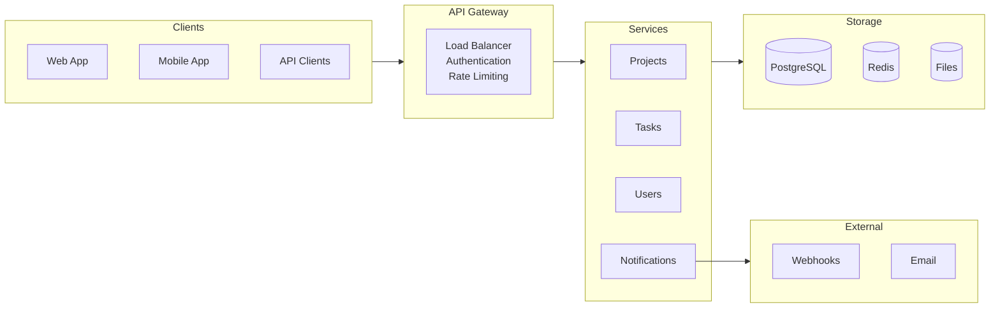

# Architecture Overview

## Introduction

This document provides a high-level overview of TaskFlow's system architecture. It's designed to help developers understand how the system works and make better integration decisions.

---

## System Architecture Diagram

## System Components

### API Gateway

The API Gateway serves as the single entry point for all client requests.

**Responsibilities:**

- Request routing
- Authentication and authorization
- Rate limiting
- Request/response logging
- API versioning

### Application Services

TaskFlow uses a service-oriented architecture with separate services for different domains:

**Core Services:**

- **Projects Service**
    - Manages project lifecycle
- **Tasks Service**
    - Handles task operations
- **Users Service**
    - User management and authentication
- **Notifications Service**
    - Email and webhook delivery

Each service is independently deployable and scalable.

### Data Storage

**Primary Database**

- PostgreSQL for transactional data
- Projects, tasks, and user information
- Relational data with foreign key constraints

**Cache Layer**

- Redis for session management
- Frequently accessed data caching
- Rate limiting counters

**File Storage**

- Cloud storage for attachments
- Pre-signed URLs for secure access
- Automatic backup and replication

---

## Request Flow

### Typical API Request

1. Client sends request to API Gateway
2. Gateway validates authentication
3. Gateway checks rate limits
4. Request routed to appropriate service
5. Service processes request
6. Service queries/updates database
7. Response returned to client

### Asynchronous Operations

Some operations are processed asynchronously:

1. Request accepted immediately
2. Job queued for processing
3. Client receives job ID
4. Processing happens in background
5. Client can poll for status
6. Webhook sent on completion (if configured)

---

## Security Measures

### Authentication

- API key authentication for programmatic access
- JWT tokens for session management
- OAuth 2.0 for third-party integrations

### Data Protection

- TLS 1.3 for all communications
- Encryption at rest for sensitive data
- Regular security audits
- PII data anonymization in logs

### Access Control

- Role-based permissions (Admin, Member, Viewer)
- Resource-level access control
- API key scoping
- IP whitelist support (Enterprise)

---

## Performance Considerations

### Caching Strategy

**What's Cached:**

| Data | TTL |
|------|-----|
| User sessions | 5 minutes |
| Project metadata | 1 minute |
| Permission checks | 30 seconds |
| Rate limit counters | Rolling window |

**Cache Invalidation:**

- Automatic on updates
- Manual purge available
- TTL-based expiration

### Rate Limiting

Rate limits are applied per API key:

- Calculated on rolling window
- Headers indicate remaining quota
- Graceful degradation when exceeded
- Higher limits for paid plans

### Response Times

**Target Performance:**

| Request Type | Target |
|--------------|--------|
| GET requests | < 200ms p95 |
| POST/PUT requests | < 500ms p95 |
| List requests | < 1s p95 |
| Search requests | < 2s p95 |

---

## High Availability

### Redundancy

- Multiple application instances
- Database replication
- Cross-region backup
- Automatic failover

### Monitoring

**System Monitoring:**

- Health check endpoints
- Performance metrics
- Error rate tracking
- Uptime monitoring

**Alerting:**

- Automated incident detection
- On-call rotation
- Escalation procedures
- Status page updates

### Disaster Recovery

- **RTO (Recovery Time Objective):** 4 hours
- **RPO (Recovery Point Objective):** 1 hour
- Daily backups retained for 30 days
- Point-in-time recovery available

---

## Integration Points

### Webhooks

Webhooks provide real-time notifications for system events.

**Delivery Guarantees:**

- At-least-once delivery
- Exponential backoff for retries
- Maximum 5 retry attempts
- Dead letter queue for failures

**Security:**

- Signature verification
- HTTPS endpoints only
- IP whitelist optional

### Batch Processing

For bulk operations:

- Maximum 100 operations per batch
- Transactional processing
- All-or-nothing execution
- Detailed error reporting

---

## Development Environment

### API Environments

**Production**

- `api.taskflow.example`
- Live customer data
- Full monitoring and backup

**Sandbox**

- `api-sandbox.taskflow.example`
- Test data only
- Same functionality as production
- Data reset weekly

### Testing

**Available Tools:**

- Postman collection
- API playground
- Sample applications
- Test data generator

---

## Scalability

### Current Scale

- 10,000+ API requests per minute
- 1M+ tasks managed
- 99.9% uptime SLA
- Sub-second response times

### Growth Strategy

**Horizontal Scaling:**

- Add service instances as needed
- Database read replicas
- Cache cluster expansion

**Vertical Scaling:**

- Upgrade instance sizes
- Database optimization
- Query performance tuning

---

## Future Roadmap

### Planned Improvements

**Short Term (Q1 2025):**

- GraphQL API support
- WebSocket for real-time updates
- Enhanced search capabilities

**Long Term (2025):**

- Multi-region deployment
- Advanced analytics API
- Machine learning features

---

## Support

### Documentation

- **API Reference**: [docs.taskflow.example](../api-documentation/overview.md)
- **Status Page**: status.taskflow.example
- **Change Log**: changelog.taskflow.example

### Contact

- **Technical Support**: api-support@taskflow.example
- **Security Issues**: security@taskflow.example

---

*Last Updated: October 2025*  
