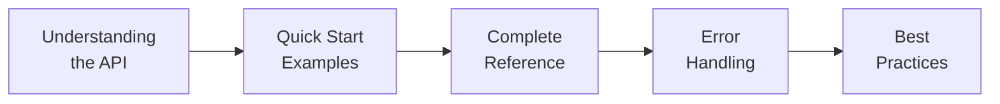

# Developer Portal Samples

-   :material-api:{ .lg .middle } **OpenAPI Specification**

    ---

    Interactive API documentation with Swagger UI sandbox

    [:octicons-arrow-right-24: Explore API](openapi/index.md)

-   :material-language-python:{ .lg .middle } **SDK Documentation**

    ---

    Comprehensive Python library documentation with examples

    [:octicons-arrow-right-24: View SDK Guide](sdk/httpx-guide.md)

---

## About This Section

This Developer Portal section demonstrates my ability to create comprehensive developer-focused documentation. Each sample showcases different aspects of technical writing for developer audiences.

### What's Included

| Sample | Description | Skills Demonstrated |
|--------|-------------|---------------------|
| **[OpenAPI Specification](openapi/index.md)** | Complete OpenAPI 3.0 spec for PokeAPI with interactive Swagger UI | API design, schema modeling, interactive docs |
| **[HTTPX SDK Guide](sdk/httpx-guide.md)** | Full SDK documentation for Python HTTP client | Code examples, async patterns, migration guides |

---

## Documentation Approach

### Developer Experience First

When creating developer documentation, I focus on:

### Key Principles

!!! success "Documentation Standards"

    === "Clarity"

        - Clear, concise explanations
        - Consistent terminology
        - Logical information architecture

    === "Completeness"

        - All endpoints/methods documented
        - Request and response examples
        - Error scenarios covered

    === "Usability"

        - Working code examples
        - Copy-paste ready snippets
        - Interactive elements where possible

---

## Technical Skills Demonstrated

:material-file-code: **OpenAPI/Swagger**
: Writing and validating OpenAPI 3.0 specifications

:material-language-python: **Code Documentation**
: Python SDK documentation with async patterns

:material-api: **API Documentation**
: RESTful API reference documentation

:material-test-tube: **Interactive Docs**
: Embedding Swagger UI for live API testing

:material-code-json: **Data Modeling**
: JSON Schema definitions and examples

:material-book-open-variant: **Developer Guides**
: Getting started guides and tutorials

---

## Tools & Technologies

| Category | Tools Used |
|----------|------------|
| **Specification** | OpenAPI 3.0, JSON Schema |
| **Documentation** | Swagger UI, MkDocs Material |
| **Validation** | Swagger Editor, Spectral |
| **Testing** | Postman, curl |
| **Version Control** | Git, GitHub |

---

## Sample Highlights

### OpenAPI Specification

The PokeAPI specification includes:

- **8 documented endpoints** covering Pokemon, abilities, types, and more
- **15+ schema definitions** with full property descriptions
- **Interactive sandbox** for testing API calls
- **Multiple examples** for each endpoint

[:octicons-arrow-right-24: View OpenAPI Sample](openapi/index.md){ .md-button }

### SDK Documentation

The HTTPX documentation includes:

- **Installation guides** for multiple package managers
- **Sync and async examples** with real code
- **Authentication patterns** (Basic, Bearer, Custom)
- **Error handling** best practices
- **Migration guide** from requests library

[:octicons-arrow-right-24: View SDK Sample](sdk/httpx-guide.md){ .md-button }

---

## Why Developer Portals Matter

A well-designed developer portal reduces:

| Metric | Impact |
|--------|--------|
| **Time to First API Call** | Developers integrate faster |
| **Support Tickets** | Self-service documentation |
| **Integration Errors** | Clear examples prevent mistakes |
| **Developer Frustration** | Better DX = happier developers |

---

*Last Updated: October 2025*
